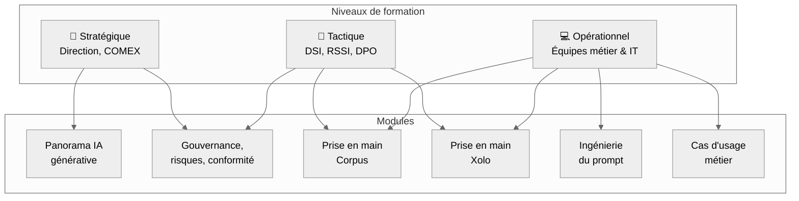

## L'essentiel

> L'IA générative est déjà dans votre organisation, mais vos équipes manquent de repères pour l'utiliser de manière **sécurisée, productive et conforme**.    La formation IA Cadoles comble ce fossé : des parcours concrets, ancrés dans vos réalités métier et techniques, qui transforment vos collaborateurs en **utilisateurs avertis** et vos décideurs en **pilotes éclairés** de votre stratégie IA.

## Le problème que vous avez déjà

L'adoption de l'IA s'est imposée avant que les compétences n'arrivent. Pour une organisation, cela se traduit par :

- **Risques non maîtrisés** : collaborateurs qui utilisent des IA publiques sans conscience des enjeux de confidentialité, de RGPD ou de secret des affaires.
- **Fracture numérique** : une minorité d'early adopters très à l'aise, une majorité qui n'ose pas ou qui utilise mal.
- **Décision aveugle** : comités de direction qui doivent trancher sur l'IA sans en comprendre les fondamentaux, les risques, ni les opportunités.
- **Shadow IT IA** : prolifération d'outils non cadrés, sans gouvernance, sans visibilité sur les coûts.
- **Frein à l'innovation** : peur du risque qui bloque toute adoption, là où vos concurrents avancent.

> **Le vrai sujet n'est pas "faut-il former ?"** : c'est _"comment former juste, vite, et pour un impact mesurable ?"_

## La réponse Formation IA Cadoles

Un **parcours de formation modulaire** qui couvre tous les niveaux de votre organisation, de la sensibilisation stratégique à la prise en main opérationnelle de Corpus et Xolo.

## Vue d'ensemble fonctionnelle

| Domaine              | Capacité Formation IA Cadoles                       | Bénéfice organisation                        |
| -------------------- | --------------------------------------------------- | -------------------------------------------- |
| **Stratégie**        | Ateliers COMEX, panorama IA, feuille de route       | Décision éclairée, alignement business       |
| **Conformité**       | Modules RGPD, IA Act, gouvernance des données       | RSSI et DPO outillés, risques documentés     |
| **Souveraineté**     | Approche open source, auto-hébergement, AGPLv3      | Indépendance technologique, pas de vendor lock-in |
| **Prise en main**    | Workshops pratiques Corpus + Xolo                   | Adoption immédiate, productivité mesurable   |
| **Ingénierie IA**    | Prompt engineering, modèles virtuels, plugins       | Autonomie des équipes, qualité des réponses  |
| **Cas d'usage**      | Co-construction de use cases sur vos données réelles| ROI rapide, appropriation par les métiers    |

---

## 1. Parcours Stratégique — Décider avec discernement

**Pour qui ?** Direction générale, COMEX, élus, administrateurs.

**Objectif** : donner aux décideurs les clés pour piloter une stratégie IA sans naïveté technologique.

| Module                              | Durée   | Format           |
| ----------------------------------- | ------- | ---------------- |
| Comprendre l'IA générative          | 1h30    | Conférence-atelier |
| Opportunités, risques et impacts métier | 2h   | Atelier interactif |
| Gouvernance IA : RGPD, IA Act, conformité | 2h | Atelier DPO/RSSI |
| Construire sa feuille de route IA   | 3h      | Workshop COMEX   |

> **Livrable** : une cartographie des opportunités et risques IA propres à votre organisation, et une première ébauche de feuille de route.

---

## 2. Parcours Tactique — Piloter et sécuriser

**Pour qui ?** DSI, RSSI, DPO, responsables innovation, chefs de projet IT.

**Objectif** : maîtriser les solutions Cadoles (Corpus, Xolo) comme socle technique de votre gouvernance IA.

| Module                                  | Durée | Format        |
| --------------------------------------- | ----- | ------------- |
| Déploiement et configuration de Corpus  | 3h    | Atelier technique |
| Déploiement et configuration de Xolo    | 3h    | Atelier technique |
| Sécurisation des flux IA (anonymisation, pseudonymisation) | 2h | Atelier RSSI |
| Pilotage FinOps IA (quotas, suivi, alertes) | 2h | Atelier DSI  |
| Intégration SI (OIDC, API, MCP)          | 2h    | Atelier technique |

> **Livrable** : une instance Corpus / Xolo opérationnelle, intégrée à votre IdP, avec des politiques de sécurité et de quotas documentées.

---

## 3. Parcours Opérationnel — Produire avec l'IA

**Pour qui ?** Équipes métier, chargés de projet, documentalistes, développeurs.

**Objectif** : rendre chaque collaborateur autonome et efficace avec les outils IA internes.

| Module                                   | Durée | Format           |
| ---------------------------------------- | ----- | ---------------- |
| Prise en main de Corpus : rechercher, interroger, partager | 2h30 | Workshop pratique |
| Prise en main de Xolo : utiliser les modèles virtuels métier | 2h30 | Workshop pratique |
| Ingénierie du prompt : obtenir des réponses précises et fiables | 3h | Atelier + exercices |
| Créer ses propres modèles virtuels et assistants | 2h | Atelier avancé    |
| Cas d'usage métier sur vos propres données | 4h | Coaching sur mesure |

> **Livrable** : des collaborateurs opérationnels sur Corpus et Xolo, avec des prompts et modèles virtuels adaptés à leurs besoins quotidiens.

---

## 4. Modalités pédagogiques

| Caractéristique      | Détail                                                    |
| -------------------- | --------------------------------------------------------- |
| **Format**           | Présentiel ou distanciel, selon vos contraintes           |
| **Taille des groupes** | 8 à 15 personnes par session (ateliers), illimité en conférence |
| **Prérequis**        | Aucun prérequis technique pour les parcours stratégique et opérationnel |
| **Support**          | Accès à une plateforme dédiée avec ressources, exercices et documentation |
| **Évaluation**       | Quiz de positionnement, exercices pratiques, questionnaire de satisfaction |
| **Certification**    | Attestation de formation et badge de compétence numérique |

---

## 5. Souveraineté et valeurs

Nos formations sont le prolongement naturel de nos logiciels :

- **Formateurs experts** : ce sont les ingénieurs qui conçoivent Corpus et Xolo qui forment vos équipes.
- **Ancrage open source** : nous formons à des outils dont vous avez le code, pas à des boîtes noires propriétaires.
- **Zéro dépendance** : les compétences acquises sont transférables ; vous n'êtes pas verrouillés par un écosystème fermé.
- **Données chez vous** : les exercices pratiques se font sur votre infrastructure, avec vos données.

> **Conséquence** : à l'issue de la formation, vous maîtrisez vos outils, vos données et votre trajectoire IA.

---

## Cas d'usage prioritaires

| Persona / Direction       | Besoin typique                                   | Apport Formation IA                |
| ------------------------- | ------------------------------------------------ | ---------------------------------- |
| **Direction Générale**    | Comprendre pour décider                          | Parcours Stratégique               |
| **DSI**                   | Déployer et piloter le socle IA                  | Parcours Tactique                  |
| **RSSI**                  | Sécuriser les usages IA                          | Modules conformité + anonymisation |
| **DPO**                   | Démontrer la conformité RGPD                     | Module gouvernance IA Act          |
| **Direction Métier**      | Acculturer et outiller les équipes               | Parcours Opérationnel              |
| **Direction RH**          | Plan de montée en compétences IA                 | Tous parcours, certification       |
| **Collectivités**         | Moderniser le service public                     | Parcours sur mesure                |

## Ce que vous gagnez, en synthèse

| Enjeu                  | Avant la formation                         | Après la formation                               |
| ---------------------- | ------------------------------------------ | ------------------------------------------------ |
| **Compétence**         | Équipes démunies face à l'IA               | Collaborateurs avertis et productifs             |
| **Sécurité**           | Usages non cadrés, risques non identifiés  | Politiques de sécurité comprises et appliquées   |
| **Décision**           | COMEX sans repères techniques              | Feuille de route IA documentée et alignée        |
| **Adoption**           | Outils IA internes sous-utilisés           | Prise en main complète de Corpus et Xolo         |
| **Conformité**         | Exposition RGPD non maîtrisée              | Processus documentés, DPO et RSSI outillés       |
| **Souveraineté**       | Dépendance aux formations éditeurs         | Compétences open source, réversibilité           |
| **Innovation**         | Freins organisationnels                    | Cas d'usage métier identifiés et lancés          |
